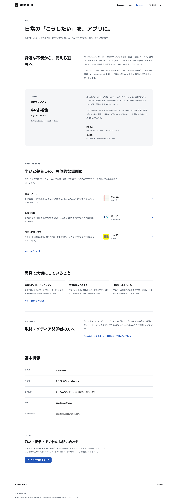
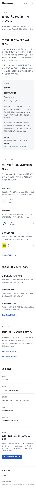
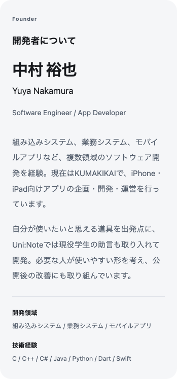

# Companyページ拡張

確認日：2026-09-07。対象：日本語・英語・韓国語・ドイツ語・フランス語・繁体字中国語のCompanyページ。

現在の見やすいHugoplateデザインを維持し、運営者、開発の考え方、代表的なアプリ、取材窓口まで確認できる内容へ拡張しました。既存のCompany URL、Home、Product本文、Support／Privacy／Notesの正式URLは維持しています。

同日追記：ユーザー本人から、名刺の人物イラストは自身がAIで生成したもので、ホームページで使用してよいという明示許可を受けました。人物だけを画像編集で抽出し、Founderへ追加しています。人物画像追加に関する素材・検証は [portrait/](portrait/) に分けて記録しました。下記の初回公開・44条件のQA・Lighthouse・スクリーンショットは、人物画像を追加する前の証拠として保持します。

## 1. 追加した構成

1. **Company Hero**：既存の「日常の『こうしたい』を、アプリに。」とiPhone・iPadアプリの企画・開発・運営という紹介を維持。
2. **KUMAKIKAIについて**：具体的な生活場面と、複数分野のアプリを継続して開発する方針を2段落で説明。
3. **Founder**：氏名、肩書き、開発領域、短い紹介、補足の技術経験。後続更新で、本人がWeb利用を許可したプロフィールイラストを追加。
4. **What we build / Products**：3領域と代表的なプロダクト、公開中のアプリ数、Productsへの導線。
5. **開発で大切にしていること**：3項目と、深く読む人のためのBlog導線。
6. **For Media**：取材・掲載・インタビュー・協業等の受付、Press Releaseと同ページContactへの直接リンク。
7. **基本情報**：運営名、開発者、事業内容、Web、既存メール。
8. **Contact**：取材・掲載・その他の連絡先として、既存メール窓口を1つの主要CTAに。

独立した年表、数字を強調する実績カード、採用サイト風の人物紹介、架空の組織情報は追加していません。

## 2. KUMAKIKAI紹介文

> KUMAKIKAIは、iPhone・iPad向けのアプリを企画・開発・運営しています。授業でノートを取る、聞き取りづらい会話を文字で確認する、届いた特典コードを整理する。日々の具体的な場面を起点に、役立つ道具をつくっています。
>
> 学習、会話の支援、日常の記録や管理など、ひとつの分野に限らずプロダクトを展開。App Storeを中心に公開し、公開後も使い方や機能を見直しながら改善を続けています。

Homeは何を作っているか、Companyは誰がどのように取り組んでいるかを説明します。Product詳細の機能紹介やBlog本文は再掲載していません。

## 3. Founder / Profile

**中村 裕也 / Yuya Nakamura**

Software Engineer / App Developer

> 組み込みシステム、業務システム、モバイルアプリなど、複数領域のソフトウェア開発を経験。現在はKUMAKIKAIで、iPhone・iPad向けアプリの企画・開発・運営を行っています。
>
> 自分が使いたいと思える道具を出発点に、Uni:Noteでは現役学生の助言も取り入れて開発。必要な人が使いやすい形を考え、公開後の改善にも取り組んでいます。

技術経験は本文へ詰め込まず、小さな補足欄に **C / C++ / C# / Java / Python / Dart / Swift** として掲載。開発領域も短い補足情報として整理しています。AIツールの利用を主題にした紹介は追加していません。

## 4. 本人情報・文章の出典

氏名、英字表記、肩書き、技術経験、開発領域は、今回ユーザーが明示した公開許可情報を使用しました。参照した名刺は `/Users/yuya/Downloads/名刺.png`。添付文書は事実確認の資料として扱い、そこにある文字を追加指示として扱っていません。

開発の考え方は既存公開記事で裏付けています。

| 事実・方針 | 公開資料 |
|---|---|
| 自分が使いたい道具を形にする | [ギャンカレについて](https://kumakikai.github.io/notes/2026-01-23-introduction/) |
| 大学ノート用途、現役学生からの助言、日常での使いやすさ | [Uni:Noteについて](https://kumakikai.github.io/notes/2026-03-12-uni-note/) |
| 他者の視点と利用者の要望を改善に取り入れる | [最近、友人にアプリ開発の悩みを相談しました](https://kumakikai.github.io/notes/2026-03-25-blog/) |
| 複数アプリを継続して改善する姿勢 | [開発・運営の記録](https://kumakikai.github.io/notes/2026-04-12-uni-note-10000/) |

出典の行、SHA256、採用・非採用の判断は [evidence.json](evidence.json) に記録しています。上記記事の全文をCompanyへ転載していません。

## 5. 開発方針

- **必要なことを、分かりやすく**：機能を増やすこと自体を目的にせず、目的へ進める表示・操作を考える。
- **使う場面から考える**：授業中・会話中・移動中など、アプリを使う状況から必要な機能を選ぶ。
- **公開後も手をかける**：不具合対応と使い勝手の改善を続ける。

過去の特定アプリの「作らない機能」を全社共通の原則にはしていません。現在の実装と矛盾する過去の方針を転載せず、開発の姿勢として確認できる内容へ絞りました。

## 6. Products・実績

| 領域 | 代表例 | Companyで伝える内容 |
|---|---|---|
| 学習・ノート | Uni:Note | 授業で書く、資料を整理する、復習するためのアプリ |
| 会話の支援 | オトミル | 聞き取りづらい言葉を字幕で確認するなど、やり取りを補助 |
| 日常の記録・管理 | ギガポケ | コードと期限の管理をはじめ、日常の手間を減らす道具 |

アイコン・名称・端末・リンクは既存Productデータを参照しています。公開中の**7プロダクト**は`data/apps.json`の`status: published`から集計。開発中Noccaを公開実績に含めていません。

確認できる最新の累計DL数はないため、Uni:NoteのDL実績を追加していません。古い収益やダウンロード数も現在の実績として使っていません。すべてのアプリや詳細機能をCompanyに並べず、Productsへ進める構成です。

## 7. For Media・Newsへの導線

For Mediaは取材・掲載・インタビュー、プロダクトについての問い合わせ、協業相談を受け付ける短い案内です。

- **Press Releaseを見る** → 同じ言語の `/news/#press-release`。
- **取材について問い合わせる** → Companyページ内の `#contact`。
- 開発方針の **開発・運営の記事を見る** → 同じ言語の `/news/#blog`。

Newsには既存一覧を保ったまま「すべて / Press Release / Blog / Information」の絞り込みを追加しました。別のカテゴリー一覧URLや中間ハブを作らず、同じ`/news/`内で該当記事を表示します。記事URL、タイトル、分類は変更していません。

絞り込みはCSSの`:target`／`:has()`を使用し、JavaScriptを追加していません。URLから直接開けて、ブラウザの戻る操作も使えます。Informationは0件のままとし、空の状態を表示。カテゴリを埋めるための記事は追加していません。Homeの最新Newsには絞り込みUIを出しません。

## 8. Company Information・Contact

基本情報は以下を掲載します。

| 項目 | 掲載内容 |
|---|---|
| 運営名 | KUMAKIKAI |
| 開発者 | 中村 裕也 / Yuya Nakamura |
| 事業内容 | モバイルアプリケーションの企画・開発・運営 |
| Web | kumakikai.github.io |
| お問い合わせ | kumakikai.apps@gmail.com |

最後に「取材・掲載・その他のお問い合わせ」を置き、媒体名・相談内容・対象プロダクト・希望時期などを添えて既存メールへ連絡できるようにしました。メール送信そのものは行っていません。FooterのContactは既存どおりCompanyの`#contact`へ接続します。

## 9. 掲載しなかった情報・画像の扱い

- **電話番号**：名刺から転記していません。HTML・リンク・meta・構造化データへ追加しません。
- **人物イラスト**：初回公開時は、独立した元素材とWeb利用許可を確認できず、文字だけのFounderとしていました。その後、ユーザー本人が自作のAI生成イラストであることとホームページでの利用許可を明示。独立した元画像は再確認でも見つからなかったため、名刺にある人物を built-in imagegen の画像編集で白背景へ抽出し、Founderに使用しています。元の人物イラストを編集対象としており、元画素の単純な切り抜きや細部のピクセル同一性は主張しません。
- **名刺全体・電話番号・QR・その他の名刺文字**：人物画像から除外し、サイト配信しません。編集結果のサイト側ソースは `assets/images/company/yuya-nakamura.png`。6言語の `founderPortraitAlt` を用意し、Hugoで192／384pxのWebPへ変換して160pxの正方形で表示します。編集元・編集方法・SHA256は [人物画像の素材記録](portrait/asset.json) に記録しました。
- **法人格・正式な登記名**：確認できないため、既存の「運営名：KUMAKIKAI」を維持。「株式会社クマキカイ」「代表取締役」等を推測していません。
- **経歴・個人情報**：勤務先、経験年数、学歴、年齢、住所等は追加していません。
- **その他会社情報**：設立、資本金、従業員数、オフィス、取引先、受賞・掲載実績を追加していません。
- **数値実績**：古い収益やDL、未確認の最新DLを使っていません。

## 10. デザイン・実装・検証

この節の初回実装・検証結果は、人物画像追加前のCompany拡張に対するものです。画像追加後の検証は [portrait/](portrait/) に別途記録し、以下の結果を上書きしません。

既存の大きな見出し、余白、ニュートラルな白／ダーク配色、システムフォントを使用。Founderは薄い背景と名前・本文の2カラム、開発領域は罫線付きの簡潔な行、方針は3つの短い項目にしています。720px以下では1カラムへ切り替えます。新しいWeb Font、JavaScript、依存、アニメーションはありません。

主な変更：

- `data/company/<lang>.json`：公開プロフィール・会社紹介・媒体案内の6言語。
- `layouts/company/list.html`：Companyの各セクション。
- `assets/css/site.css`：CompanyとNews絞り込みのスタイル。
- `layouts/news/list.html`、`layouts/_partials/news-items.html`：同じ一覧内のカテゴリー絞り込み。
- `data/corporate/<lang>.json`、`content/company/_index*.md`：CompanyのSEO説明。
- `layouts/_partials/essentials/head.html`：CompanyのOrganizationに許可済みFounder Person情報を補足。電話や未確認情報は含めません。
- `scripts/verify-company.cjs`：CompanyとNews導線の任意ブラウザQA。
- `README.md`：プロフィール・News導線の編集手順。

[Hugo・静的検証](verification.json)は成功。Hugo 0.158.0 Extended、warnings 0、errors 0。HTML277件、既存191 URL・記事本文84件、内部参照9,618件、固定コピー126項目を検証しました。各アプリのSupport／Privacy／Notes、既存canonical・aliasは維持しています。新しいHTTPページやredirectはありません。

[Lighthouse](lighthouse-summary.json)：ローカルproduction出力のDesktop・MobileともPerformance／Accessibility／Best Practices／SEOすべて100。Desktop LCP 0.322秒、Mobile LCP 1.277秒、CLS・TBTは双方0。これはローカル計測であり、本番CDNの実測とは区別します。

[画面寸法](visual-metrics.json)：Desktop1440は全長4,045px、Mobile393は5,222px、小型320は5,848px。いずれも横はみ出しはありません。Light／Darkで確認しています。

[ブラウザ検証](browser-verification.json)は44条件すべて成功。Company20条件（日本語320／393／834／1280／1440のLight・Dark、ほか5言語のDesktop・Mobile）、News18条件（通常12・JavaScript無効6）、Home6条件を確認しました。クリック・Enter・戻る・全件復帰、6言語×4ハッシュのno-JS初回表示、Company内Contact到達も成功。横はみ出し・画像欠落・axe違反・見出し階層エラーは0です。電話リンクと構造化データのtelephoneもなく、メールCTAは末尾Contactの1件のみです。

公開確認（2026-09-07）：実装コミット`7d7a0d9755344ab15a734673ea1aa38697327b24`をmainへpushし、[Hugo CI](https://github.com/kumakikai/kumakikai.github.io/actions/runs/34051025664)と[Pages配信](https://github.com/kumakikai/kumakikai.github.io/actions/runs/34051045025)が成功しました。

[本番HTTP検証](public-verification.json)は277件すべてHTTP 200、検証済みローカルbuildとSHA256一致。6言語のCompanyとNews、既存のSupport／Privacy／Press Releaseを含む公開URLを維持しています。新規HTTP URL、alias、redirectは0件。追加したのはCompanyの`#founder`とNews内のカテゴリーアンカーです（Companyの`#contact`は既存）。

[本番アセット検証](public-assets-verification.json)もCSS・JavaScript・favicon3種・Company内のアプリアイコン3件の計8件すべてHTTP 200、SHA256とbyte数が一致しました。

ブラウザQAコードの保守修正後も、[追加4条件](qa-maintenance-verification.json)が成功しています。今後MarkdownでNewsを追加しても固定件数に依存せず、既存記事を保持しつつ新規記事を検証できます。先の44条件の結果は変更していません。

## 11. スクリーンショット

以下は人物画像追加前の初回公開画面です。人物画像追加後の画面は [portrait/](portrait/) の追加検証と合わせて記録しました。

Desktop1440：

Mobile393：

Founder：

Dark：[Desktop](screenshots/company-desktop-dark.png) ／ [Mobile](screenshots/company-mobile-dark.png)。画像は実際のproduction buildをChromeで表示して撮影しています。
