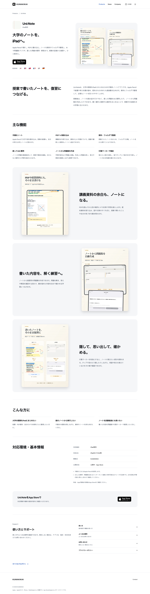
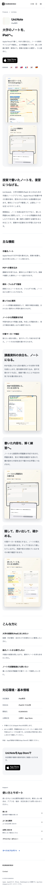
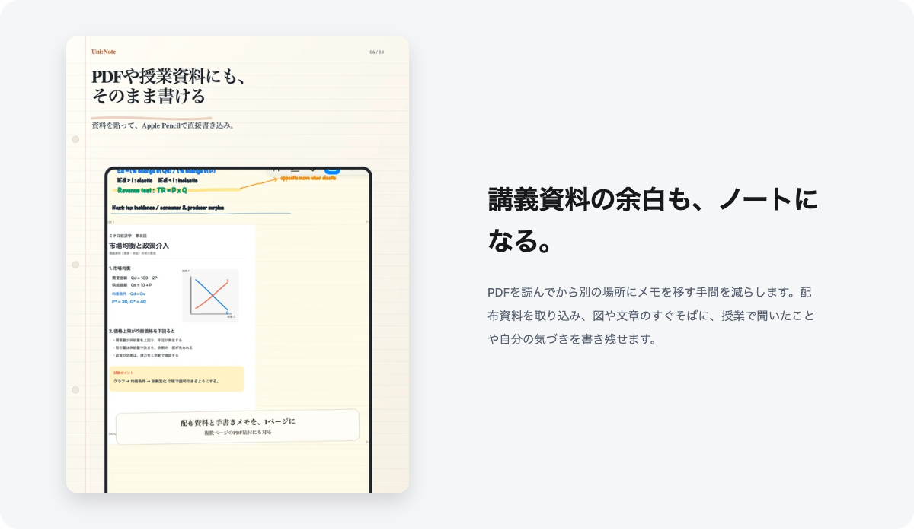
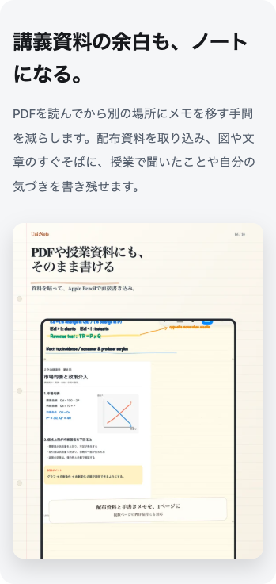

# Product詳細ページの拡張

確認日：2026-09-07。対象：8アプリ × 6言語、48 Product詳細ページ。

既存のHugoplateデザイン、Product Hero、Homeの情報設計・Featured順序・コピーを維持し、個別ページに概要、機能、実画像付きの紹介、利用場面、対応環境を追加しました。Homeは興味を持つ場所、Productは具体的な内容を理解する場所、Supportは操作方法や困りごとを調べる場所として分けています。

## 1. Uni:Noteに追加した情報

Heroの「大学のノートを、iPadへ。」と既存の短い説明は維持しました。その下に「授業で書いたノートを、復習につなげる。」というProduct専用の見出しと2段落の概要を追加。授業の板書・配布資料をiPadにまとめ、ノートを復習にも使う目的を説明しています。

主な機能は6つに絞りました。

1. **手書きノート**：Apple Pencilで文字・図・自分の考えを残す。
2. **PDFへの書き込み**：講義PDFへ直接メモし、画像や撮影資料も追加する。
3. **教科・フォルダで整理**：授業ごとに分類し、ノート名から探す。
4. **囲ってAIに質問**：選択した問題の答え・解説を確認する。
5. **ノートから問題集を作成**：AIで問題に変換し、答え・解説で復習する。
6. **付箋マーカーで暗記**：覚えたい箇所を隠し、タップで確かめる。

公開中の3.4.0のApp Store説明・リリースノート、既存の使い方、現行実装を照合しました。ローカル開発版は3.5.0ですが、3.5だけの手動問題集編集などは紹介していません。録音・文字起こし等の全機能を並べず、今回の6つの学習用途に絞っています。

## 2. 大きな画面と機能紹介

Uni:Noteは、Homeの2枚並びとは別に、1枚と説明を組み合わせた3セクションを追加しました。

| 紹介 | 採用した実際のApp Store素材 | 表示方法 |
|---|---|---|
| 講義資料の余白も、ノートになる。 | `SS06_pdf_write.png` | PDFと手書きメモを1枚で大きく表示 |
| 書いた内容を、解く練習へ。 | `SS03_problem_set.png` | 既存`screen-2`を大きく再利用し、問題集の用途を説明 |
| 隠して、思い出して、確かめる。 | `SS04_review.png` | 付箋マーカーによる暗記と復習を説明 |

新規採用2枚の原本は `/Users/yuya/Projects/uni_note/artifacts/app_store_jp_refresh_2026-09-02/final_v7/` にある公開App Store用の正式素材です。原本2064×2752から、縦横比を変えず560px／1120px幅のWebPを作成しました。

Pocketには `/Users/yuya/Projects/uni_memo/artifacts/app_store_screenshots_2026-09-02/final/SS03_practice_set.png` を追加。既存バックアップ画像と組み合わせ、「取り込む→問題の答え・解説を確認する」を別々に説明します。原本1284×2778から420px／840px幅へ最適化しました。

追加画像は原本3枚・WebP 6ファイル、合計290,436 bytesです。元画像の内容・コピー・比率を変更せず、生成画像やダミーは使っていません。各画像に幅・高さ、srcset／sizes、alt、async decodingを設定。新しい下方画像はlazy、Product Heroの2枚はLCPのためeagerとしました。Homeの読み込み指定は維持しています。

原本パス・SHA256・実寸・出力寸法・サイズは [追加素材の記録](additional-media.json) に保存しました。

## 3. こんな方に・基本情報

Uni:Noteでは、大学の授業をiPadにまとめたい方、紙のノートから移行したい方、ノートを試験勉強に生かしたい方の3項目を用意しました。

基本情報には、既存の対応端末表記、公開版と実装で一致した最低OS、開発元KUMAKIKAI、公開状況・App Store提供を掲載。AIの接続・クォータ条件と、Apple Pencilによる入力を補足しています。

| Product | 確認した公開版 | 最低OSの表示 | 新しい本文の構成 |
|---|---|---|---|
| Uni:Note | 3.4.0 | iPadOS 17.0以降 | 6機能、PDF・問題集・暗記の3画像紹介、対象利用者3項目 |
| オトミル | 1.0.1 | iOS 26.0 / iPadOS 26.0以降 | 字幕と大きな操作の3機能、開始・会話の2画像紹介、利用場面3項目 |
| ギガポケ | 0.1.0 | iOS 17.0以降 | 登録→期限→コピー→Widgetの4機能、一覧・Widgetの2画像紹介、利用場面3項目 |
| Nocca | 開発中 | 未確認のため非掲載 | 本人・家族の関係性と4機能、意思表示・役割選択の2開発画面、対象者3項目 |
| Uni:Note Pocket | 3.4.0 | iOS 17.0以降 | 閲覧専用の4機能、バックアップ・問題集の2画像紹介、移動／授業前／試験前 |
| ギャンカレ | 1.4.0 | iOS 14.0以降 | 収支入力・集計・タグ等の4機能、2画像紹介、利用場面3項目 |
| すわなび | 1.1.1 | iOS 14.0以降 | 喫煙／我慢の記録・履歴・金額推計・Widgetの4機能、2画像紹介、対象者3項目 |
| SIGNAL | 1.1.1 | iOS 13.0以降 | 配信源・記事閲覧・反応による並び替えの4機能、2画像紹介、利用場面3項目 |

各アプリの概要は2段落です。全アプリに機械的に6機能を置かず、確認できた用途に応じて3〜6個としました。料金の固定値や無料表現は追加せず、公開中アプリにはApp Storeの最新情報を確認する一文だけを置いています。配信地域はHeroの既存国旗を1回だけ表示し、言語と配信地域を分離した仕組みを維持しています。

## 4. 公開版と開発中の区別

- **Uni:Note**：公開3.4.0を基準とし、ローカル3.5.0の未公開差分を紹介しません。
- **オトミル**：画像は以前の依頼で採用済みの1.1.0審査提出素材を継続使用し、画像の審査版注記も維持。説明は公開1.0.1で確認できる字幕・シンプルモード・利用場面に限定。旧AI・課金プランは追加していません。
- **すわなび**：ローカル1.2.0のApple Watch対応は未掲載。公開1.1.1の機能を紹介します。
- **ギャンカレ**：Widgetからはアプリの入力画面を開く実装のため、「アプリを開かず記録」とは表現していません。
- **SIGNAL**：アプリ内に用意された配信源の選択に限定。任意の作者フォロー、任意RSS追加、要約・保存機能を推測していません。
- **Pocket**：Uni:Noteバックアップが必要な閲覧専用アプリ。新規作成・編集・削除や自動同期はできない条件を明記。利用可能なバックアップの起動時自動読込は既存機能なので、「更新が常に手動のみ」とは表現していません。
- **Nocca**：実装済みの本人主導の連絡・任意の会話・接続管理を、開発中の仕様として説明。App Store CTA・未確認OS・未公開Privacyは追加していません。

根拠はアプリ別の `evidence-<id>.json` に記録しています。

## 5. CTA・Support・Homeとの役割分担

公開中のProduct詳細には公式App Storeバッジを **Heroと主要説明後の2箇所** に配置しました。下部バッジの前には概要・機能・画像紹介・利用場面・基本情報があるため、近接して重複しません。未公開Noccaにはいずれも表示しません。バッジ画像は既存のApple公式6言語版を無改変で共有します。

Product上部に「詳しく見る」「サポートを見る」等を再追加していません。下部Supportの`#support`では、対象アプリの使い方・FAQ・問い合わせ・Privacy・必要なTermsへ直接到達できます。Support総合ページやアプリの再選択を経由しません。

ギガポケの非公式表記は既存Heroに維持し、同じ注意書きを下部へ重複表示しないよう整理しました。Pocketのフランス語・繁体字のバックアップ名は実装UIの「Sauvegarde rapide」「簡單備份」と一致させました。

HomeのFeatured／Other分類、順序、キャッチコピー、短い説明、スクリーンショット、App Storeと詳細CTAは変更していません。Homeに詳細本文を増やさず、Productで初めて次の情報を得られます。

- なぜ・どのような場面で使うアプリか。
- 3〜6の具体的な機能と利用フロー。
- 1画面ずつ大きく確認できる実際の使いどころ。
- 対象利用者、最低OS、必要なバックアップや接続条件。

## 6. URL・ナビゲーション・既存内容

- Header：**Products / News / Company**。
- Footer：**Contact**。
- Productsが唯一のアプリ選択ハブ、カードの「サポート」はProductの`#support`へ直接接続。
- 新設URL：**なし**。既存48 Product URLの内容を拡張しました。
- aliases／redirectの追加・変更：**なし**。
- 既存のSupport・使い方・FAQ・Privacy・Terms・Notes本文URLを移動・削除していません。
- 191旧HTML URL、138正式URL、53既存alias、記事本文84件のbaselineを維持。
- canonical、OGP、構造化データ、sitemap・robotsの既存構成を維持。

App Store Connect関連の正式URL一覧は [恒久URL一覧](../migration/permanent-urls.md) を継続使用します。URLごとの公開HTTP検証は公開後に本レポートへ追記します。

## 7. 実装・保守

| 変更箇所 | 内容 |
|---|---|
| `data/product_details/<id>.json` ×8 | Product専用6言語本文・確認済みOS・追加実素材参照 |
| `data/product_ui/<lang>.json` ×6 | 共通見出し・基本情報ラベル・下部CTA |
| `layouts/product/single.html` | 既存HeroとSupportの間に専用紹介を挿入 |
| `layouts/_partials/product-details.html` | 概要・機能・画像紹介・対象者・基本情報・下部CTA |
| `layouts/_partials/app-store-badge.html` | 公式バッジの描画を共通化し、公開状態を検査 |
| `layouts/_partials/app-cta.html` | Home／Heroから公式バッジ共通部品を利用 |
| `layouts/_partials/app-screenshots.html` | Product Heroだけeager指定を受け取る |
| `assets/css/site.css`、`main.css` | Product専用レイアウト・レスポンシブ指定、生成対象をHugoの実出力へ限定 |
| `static/images/apps/uni-note/`、`uni-note-pocket/` | 追加3実素材のWebP 6ファイル |
| `scripts/verify-migration.py`、`verify-browser.cjs` | 追加内容・実画像・上下CTA・長頁Supportの検証 |
| `README.md` | Product専用データ・実画像・事実確認の編集手順 |

Hugoplate本体、依存、JavaScript、GitHub Actionsの変更はありません。Tailwind/Hugoの現在のproduction buildとPages公開方式を使用します。

## 8. 検証

[静的検証結果](verification.json)：Hugo 0.158.0 Extendedのproduction build成功、warnings 0、errors 0。

- 48詳細ページ、102画像付き紹介、126固定コピー項目を検証。
- HTML277件、ローカル参照9,534件、既存本文84件を検証。
- Apple公式バッジ6素材／表示126箇所（Home各1、Product各2）、国旗252箇所を検証。
- SEO204ページ、構造化データ204ブロック、sitemap200項目を検証。

[ブラウザ検証結果](browser-verification.json)：73ケースと共通操作すべて成功。

- 全8 ProductをDesktop1280 Light／Mobile393 Darkで確認。
- Uni:NoteはiPad834／小型iPhone320のLight・Dark、非日本語5言語の393px Darkも検証。
- その他Home／Productsの1440・1280・iPad・iPhone等の表示、旧Supportの96fragment、メニュー、keyboard、Escape、no-JS導線を継続検証。
- 横はみ出し0、画像エラー0、axe違反0、見出し階層の飛び0。
- Story画像の実表示幅244〜450px。ページ内セクションの重なりなし。

[目視計測](visual-metrics.json)：Uni:NoteのDesktop1440は全長5,686px、画像450px幅。1000px高の画面で約5.7画面分です。Mobile393は全長7,662px、画像317px幅。小型320でも横はみ出しはなく、244px幅で画像が表示されます。Tablet834は本文と画像の2カラムを維持し、720px以下で本文→画像へ1カラム化。上部Heroは現在の自然な切替を維持しています。

大きな余白、白／ダークのニュートラル背景、太い見出しを維持。機能・対象者は罫線付きの簡潔なリストとし、小さなカードを大量に追加していません。Productの新しいアニメーション・JavaScript・Web Fontはありません。

[Lighthouse結果](lighthouse-summary.json)：ローカルproduction出力をChromeで測定。DesktopはPerformance／Accessibility／Best Practices／SEOすべて100、Mobileは99／100／100／100。Desktop LCP 0.443秒、Mobile LCP 2.027秒、双方CLS 0・TBT 0。Product Heroのlazy属性によるLCP発見の指摘を修正し、再測定で解消を確認しました。ローカルサーバーのcache・圧縮指摘と本番CDN評価は分けています。

[最終差分の重点検証](final-focused-verification.json)：Uni:Noteの1440／393、Pocketのフランス語／繁体字393、ギガポケ393の5条件で、Heroのeager・Homeと本文のlazy、修正したUI用語、免責文の重複除去、CTA／Support、axeを再確認し成功しました。

初回公開では全277 HTMLがHTTP200でしたが、CIのCSSに未使用の`.table`ルールが1つ加わり、ローカルとのfingerprint一致検証で差を検出しました。本番HTMLが参照するCSS自体はHTTP200で表示も正常でした。検証記録等をTailwindが自動探索する影響を除くため、生成対象を`hugo_stats.json`の実際のページ内クラスだけに限定しました。キャッシュを変えたbuildでも同一CSS SHA256を確認しています。JavaScriptが付ける状態クラスは既存の手書きCSSで維持しています。修正後のCSSでも73ケース＋共通操作・no-JS検証を再実行し、すべて成功しました。[7条件の撮影比較](css-visual-comparison.json)でもページ長・幅・画像サイズは一致しています。

## 9. 未解決事項・素材不足

今回の48 Product紹介ページの実装に未対応箇所はありません。新規に必要な実素材も確認できています。Noccaは開発中のため公開版画像・App Storeリンク・確認済み最低OSはありません。オトミルの画像は審査提出版であることを表示しています。

監査では、一部の既存Support本文に古い記述が見つかりました（Uni:Noteの範囲移動の課金区分、オトミルのApple Intelligence前提・旧課金説明、Noccaの過去プロトタイプの通信説明）。今回の新しいProduct本文へは採用していません。既存Support本文の改訂は行っておらず、URL・本文保持の検証対象として残しています。詳細はアプリ別証跡の `knownSourceConflicts`／`excluded` を参照してください。

公開App Store、ソース、Webブラウザでの検証です。各アプリの実機操作やApp Store Connectの登録内容の変更は行っていません。

## 10. スクリーンショット

Desktop1440・Light：

Mobile393・Light：

大きなPDF機能紹介：

Dark：[Desktop](screenshots/uni-note-desktop-dark.png) ／ [Mobile](screenshots/uni-note-mobile-dark.png)。すべてproduction buildのブラウザ表示を撮影したものです。
