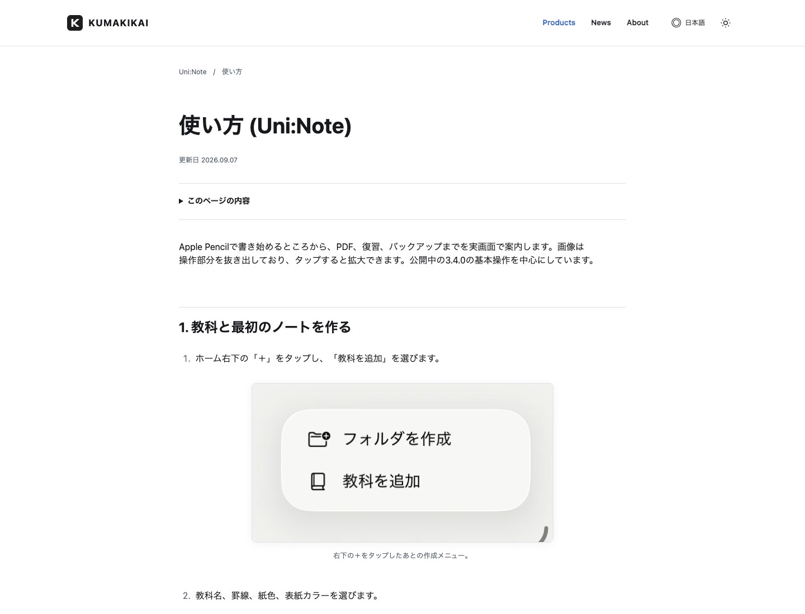
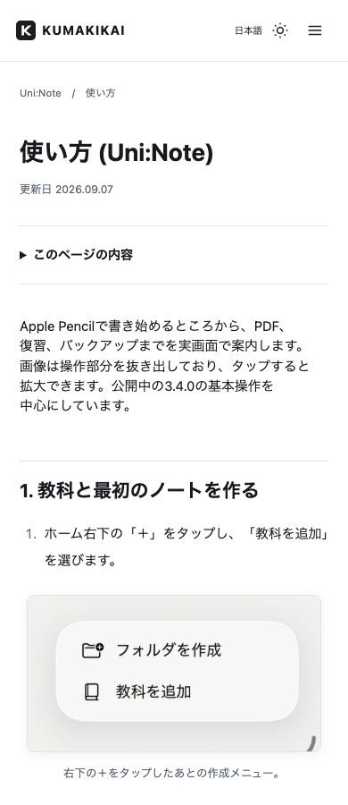

# 実画面付き使い方ガイドへの改訂

更新日: 2026-09-07

## 対象と役割

既存8アプリの使い方22ページ、FAQ22ページを監査・改訂しました。Productsは製品紹介、使い方は操作手順、FAQは利用条件・問題・例外を説明します。正式URLと既存のページ内アンカーを維持し、FAQから該当操作へ直接進めます。

| アプリ | 使い方の正式URL | 更新言語 | 主な画像付き操作 |
|---|---|---|---|
| Uni:Note | `/htu/uni-note/` | ja / en / de / fr / ko / zh-hant | 新規作成、パレット、タイトル検索、写真・PDF、録音、付箋・問題の解答、バックアップ |
| Uni:Note Pocket | `/htu/uni-note-pocket/` | ja / en / de / fr / ko / zh-hant | zip取り込み、ノート一覧・検索、ページ閲覧、付箋・問題集 |
| オトミル | `/htu/oto-miru/` | ja | 場面選択、字幕開始・停止・反転、表示設定、聞き取り環境、利用時間 |
| ギガポケ | `/htu/giga-poke/` | ja | 特典登録、編集、利用、ゴミ箱、通知・自動整理設定 |
| Nocca | `/htu/nocca/` | ja | 役割選択、招待、意思表示、返信、会話、通信休止 |
| ギャンカレ | `/htu/balance-calendar/` | ja | 矢印ボタン、金額入力、日付・履歴、収支一覧、ウィジェット、タグ設定 |
| すわなび | `/htu/smokeless/` | ja / en / fr / ko / zh-hant | 我慢・喫煙の記録、履歴、カレンダー、グラフ、銘柄設定、Apple Watch |
| SIGNAL | `/htu/signal/` | ja | タブと記事カード、記事メニュー、配信源スイッチ、文字サイズ・テーマ |

各行と同じ言語の `/faq/<app>/` も更新しています。翻訳URLには `/en/` など従来の言語接頭辞が付きます。全44件のファイル・URLは `reviewed-content.json`、全22ガイドの画像・言語は `asset-inventory.json` に記録しています。

## 旧仕様・重複の整理

| アプリ | 確認・修正内容 |
|---|---|
| Uni:Note | 範囲移動をPremium限定としていた説明を修正。タイトル検索は本文・手書き検索と区別。録音・文字起こしの条件を現行実装へ整理。古い更新履歴と操作の二重掲載を削減。 |
| Pocket | タイトル検索と、かんたんバックアップの更新状態確認・手動読み込みを追加。旧版や古い一括表示アイコンの説明を撤去し、現在の付箋ごとのタップへ統一。 |
| オトミル | Apple Intelligence必須・旧AI機能・古い試用期間説明を整理。現在の端末内Apple Speech、Free/Plus、表示・聞き取り環境の設定と照合。 |
| ギガポケ | メール/ペーストから登録し、期限を確認して使う流れへ整理。利用ボタンと外部サービスの利用完了を区別。通知時刻・対象、ゴミ箱・ウィジェットの条件を確認。 |
| Nocca | 古いローカルプロトタイプの説明を現在の公開前実装へ更新。本人承認、対応/完了の返信、取消、前回の会話、同期、引き継ぎを説明。 |
| ギャンカレ | 「+収入/−支出」という文章中心の案内を実UIの矢印へ修正。ウィジェットからはアプリの金額入力を開くことを明記。 |
| すわなび | 1タップで当日の1回を記録する操作、現在の取消文言を確認。銘柄数は通常1・パック購入後4と区別。広告条件を正確化。 |
| SIGNAL | GOOD/BADの文字だけでなく現在のアイコンと実画面を対応。反応の取消、再読込後の反映、段階表示・通信失敗時の扱いを追加。 |

FAQ内の長い操作手順は使い方の該当アンカーへ移し、原因・制限・例外をFAQに残しました。本文末尾に重複していた使い方・FAQ・Privacy一覧は、同じ正式URLを示す共通のアプリ別サポート欄へまとめています。全体のSupportハブやアプリの再選択は経由しません。

公開版と開発版は区別しています。Uni:Noteは公開3.4.0とローカル3.5.0、オトミルは公開版と最新の提出用素材・開発版、Noccaは開発中、すわなびのApple Watchは公開前として案内します。ローカルのビルド成功をApp Store公開済みの根拠にはしていません。

## 実画面と最適化

実アプリの既存raw画面を現行コードと照合し、不足箇所はSimulatorで操作して新規取得しました。マーケティング用の訴求コピー画像、AI画像、描き直したUIは使っていません。アプリ側のソースと既存の作業差分は保持し、本番購入・実ユーザーデータは使用していません。

採用した元画面は96枚です。うち今回の新規Simulator撮影32枚から35点、既存の実画面64枚から82点を作成し、計117画像を22ページ・143箇所で使用しています。既存のApple Watchガイド5言語分を含めた表示は148箇所です。1枚から複数の操作部分を切り出す場合があるため、撮影枚数と掲載画像数は異なります。全件の元画像・出力SHA-256照合、出典・参照・未使用チェックは [provenance-verification.json](provenance-verification.json) に記録しました。

- Crop: 操作ボタン、ナビゲーション、設定項目、カードや入力パネルを切り出し。
- Full Screen: Pocketの連続ページ、字幕の向きと停止ボタン、一覧やグラフなど、位置関係が必要な場面で採用。
- 元画像とcrop座標、SHA-256、取得元・版の根拠は各 `*-assets.json` と `*-audit.md` に記録。
- `assets/images/guides/<app>/` に用途を示す名前で保存。既存のHome/Product画像は参照があるため削除していません。
- HugoでWebP q92、1x/2xの `srcset` と `sizes` を生成。元画像以上に拡大しません。
- 原則lazy、async decoding、幅・高さ、操作対象を示すaltを共通設定。画像リンクから大きな画像を開けます。
- Cropの表示上限560px、iPhone画面320px、iPad画面760px。Mobileでは本文幅内に余白を残して収めます。
- 表示モードの内訳はcrop 108箇所、iPhone幅29箇所、iPad幅6箇所です。最適化後の全言語・全解像度の218ファイル合計は4,310,646 bytesで、1ページですべてを読み込むものではありません。
- 目次は長い使い方ページに限定。ネイティブのdetailsとアンカーを使い、JavaScriptやWebフォントを追加していません。
- 実際の改訂日を全対象ページの `lastmod` と表示日に使用。
- 初期レビューで使った単独の「＋」画像は、メニューまで見える新規画面へ置換し、未参照確認後に削除しました。今回起動した撮影用Simulatorは終了済みです。

## 検証

- **Production build: PASS**。Hugo Extended 0.158.0 / Node 22.22.0。日本語組版の本文・リンク・メタデータ保持テストも成功。
- **既存URL・本文保護: PASS**。移行前191 URL（正式本文138・既存alias 53）、本文84件、10,517内部参照を検査。今回の44ガイド/FAQだけ個別改訂を認め、Privacy・Terms・Press Release本文と元baselineを保持。エラー・警告0。[build-verification.json](build-verification.json)
- **実ブラウザ: Chrome 220ケース、WebKit 132ケースがPASS**。日本語ガイドは1440 / 1280 / 1024 / 768 / 430 / 390 / 375pxをChromeで確認。全言語ガイドを1440 / 390px・Light / Darkで、全FAQを同2幅で確認。WebKitも全44ページを確認。8アプリの日本語ガイドはJavaScript無効時も確認。
- **画像・操作・アクセシビリティ: PASS**。全画像の読込、alt、サイズ予約、WebP/srcset、拡大リンク、目次のキーボード操作、focus、見出し階層、重複IDを検査。画像404・横overflow・自動アクセシビリティ違反0。Chromeで測定した画像読込時のLayout Shiftは0。
- **改行の追加修正**。日本語の短い見出し末尾は検出なし。韓国語すわなびの長いカレンダー見出しを「캘린더로 기록을 확인합니다」へ短縮し、旧アンカーを保存。該当ページとFAQを両engineで各6ケース追加確認しました。初回の検出と修正後の証拠を `chrome-browser.json` / `korean-final-*.json` に分けて記録しています。
- **通常viewportでの目視: PASS**。全8アプリの日本語ガイドを1440 / 390pxでスクロールし、画像内の文字と前後の操作説明を確認。全ページを縮小した画像だけで判定していません。結果は [学習・SIGNAL・ギャンカレ](editorial-learning-signal.md)、[オトミル・ギガポケ・Nocca・すわなび](editorial-communication-utilities.md)。
- **目視で直した箇所**。Uni:Noteの作成メニュー、AI結果のコピー/共有、バックアップ、Pocketの取り込みを操作対象が分かるcropへ再調整。ギャンカレのウィジェットはiPhone幅に抑制。ギガポケは詳細画面を開く説明を補い、共通CSSで操作名の前後に出ていたバッククォートを除去。再撮影で解消を確認。
- **Lighthouse Mobile: 100 / 100 / 100 / 100**（Performance / Accessibility / Best Practices / SEO）。Uni:Noteガイドのローカルproduction buildを1回測定。LCP 1.7秒、CLS 0。実利用者の通信環境や本番field dataを示す値ではありません。原則lazyの先頭操作画像、ローカルサーバーの圧縮・cache等には診断上の改善候補がありますが、重大な劣化はありません。[測定記録](lighthouse-mobile.json)

### 公開反映

- 実装commit: `fc604537e4318dad12eb489f5d2844becd2197cc`。mainへpush済み。
- [Hugo build・互換性チェック・gh-pages生成](https://github.com/kumakikai/kumakikai.github.io/actions/runs/34061976503): success。
- [GitHub Pages公開](https://github.com/kumakikai/kumakikai.github.io/actions/runs/34062006016): success。公開生成物は `652e55a88a101bc161c700cd2e5de3c86b95edd2`。
- **本番277 HTML URLすべてHTTP 200、検証済みローカルHTMLとSHA-256一致**。既存Privacy・Support・使い方・FAQ・Press Releaseを含みます。[全URL結果](public-verification.json)
- **本番ガイド画像218種類すべてHTTP 200、確定したgh-pages生成物とSHA-256一致**。[全画像結果](public-image-verification.json)
- 画像のうち217種類はmacOS側buildともバイト一致。オトミルの通常モード上部560×150画像1点は生成環境間で微小な画素差があり、クリーンなローカル再生成でも同じ差を再現しました。平均RGB差は255段階中0.009、同寸法で、見出し・4つのモード・設定ボタンを両画像で目視照合。別画像・古いUIへの置換や表示欠損ではありません。ローカルと本番の全画像がバイト単位で同一とはしていません。
- 公開サイトのUni:Noteガイドを1440 / 390pxのChromeで再確認。更新日・9枚の実画面・全画像読込・CSS/JS応答・横幅を確認しました。[本番ブラウザ結果](public-browser.json)

## 代表的な使い方ページ

[Uni:Noteの使い方](https://kumakikai.github.io/htu/uni-note/) — 旧URLをそのまま使用。

公開サイトのDesktop表示:

Mobileの冒頭と最初の操作:

全体の長さも確認できる [Desktop全体](screenshots/chrome-uni-note-1440.jpg) / [Mobile全体](screenshots/chrome-uni-note-390.jpg) と、他7アプリの画像を `screenshots/` に保存しています。

## 素材・確認範囲の限界

通常操作は画像で案内し、短い初期設定・購入条件や例外操作まで全機能マニュアルにはしていません。日本語Pocketの検索欄は現行の英語実画面を使い、英語画面であることをキャプションに明示しています。

ギガポケのOSウィジェット追加画面、Noccaの引き継ぎ・削除の個別確認画面などは今回掲載していません。これらは短い手順で案内し、主要な通常操作を実画面付きにしました。オトミルの最新素材と公開版には差があるため、最新ガイドを公開済み版と誤認しないよう冒頭に版の区別を置いています。App Store Connectの実際の提出状態をこの作業で確認済みとはしていません。

既存Privacy/Terms/Press Release本文は今回変更していません。Noccaの古いプロトタイプ段階の法務記載と現行実装の差は、アプリ公開前の別途確認事項として監査記録に残します。個別の恒久URLはそのままです。

アプリ実装の照合、Simulatorでの画面取得、Web build、ブラウザ表示、公開HTTP確認は別の検証です。Apple Pencil実機、実際の音声認識、iCloudアカウント連携、課金、Pushや端末間通信の本番E2Eを今回のWeb改訂で検証済みとはしていません。

## 主な変更ファイル

- `content/htu/*.md`、`content/faq/*.md`: 既存44ページの手順・FAQ・最終更新日。
- `layouts/_shortcodes/guide-image.html`、`guide-anchor.html`: 共通画像と旧アンカー。
- `layouts/_partials/guide-toc.html`、`layouts/single.html`、`data/guide_ui.json`: 目次・更新日・翻訳。
- `assets/css/site.css`: 画像、Step、Note、目次の共通表示。
- `scripts/verify-guides.cjs`、`audit-guide-assets.py`: ブラウザと画像配信検証。
- `scripts/verify-migration.py`、`record-guide-review.py`: 今回承認されたガイド/FAQ改訂のみ記録し、旧URL・法務本文を引き続き保護。
- `README.md`、`docs/visual-guides/`: 今後の保守方法と全監査記録。
